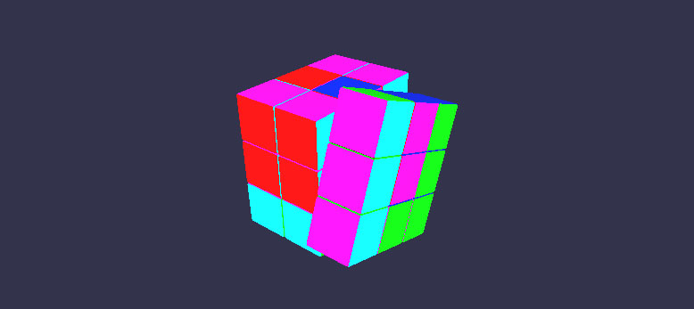

*马逸东 | 2015210056 | myd15@mails.tsinghua.edu.cn*

## A2 魔方
要求：  

* 可以用鼠标旋转任意角度
* 实现用鼠标放大缩小效果
* 实现层次的转动（比如点击一层则旋转一层），包括水平层的转动和垂直层的转动
* 可以选择灯光
* 改变魔方背景
* 使用弹出式菜单选择2-6阶魔方的显示

### 实验环境

Windows 10 + Visual Studio 2013 + OpenGL3.3, 依赖库：Assimp, SOIL, GLEW, GLM

### 实验原理

矩阵运算：平移，缩放，旋转  
包围盒求交  
鼠标交互  

### 实验步骤

将单元模型读入，以矩阵方式显示出来  

根据视线方向与模型求交，找到被击中的单元块  

依据鼠标移动的方向让被选中的一行或一列进行旋转  

交互操作：  
`Ctrl + MouseL`: 旋转魔方  

`2`: 变为2阶  
`3`: 变为3阶  
`4`: 变为4阶  
`5`: 变为5阶  
`6`: 变为6阶  

`W`: 前进  
`A`: 后退  
`S`: 向左  
`D`: 向右  
`ScrollUp`: 放大  
`ScrollDown`：缩小  
`Alt + MouseL`: Rotate  
`Alt + MouseR`: Pan  

*注：由于GLUT不支持OpenGL3.3+，并且GLEW不提供GUI功能，实验所有的交互不使用右键PopUpMenu，而都使用鼠标键盘。*  

### 实验效果

  

