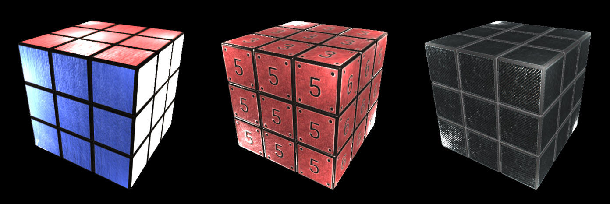
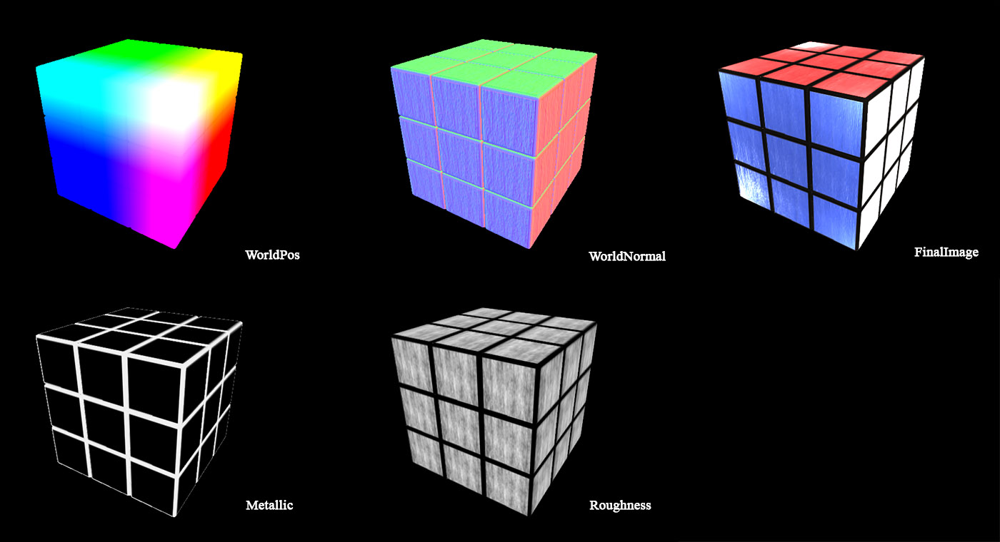
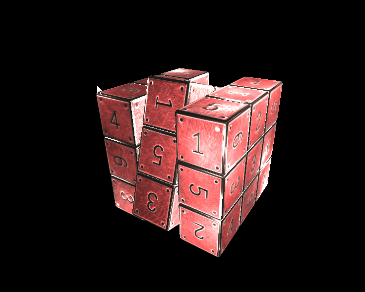

*马逸东 | 2015210056 | myd15@mails.tsinghua.edu.cn*

## A2 魔方
要求：  

* 可以用鼠标旋转任意角度
* 实现用鼠标放大缩小效果
* 实现层次的转动（比如点击一层则旋转一层），包括水平层的转动和垂直层的转动
* 可以选择灯光
* 改变魔方背景
* 使用弹出式菜单选择2-6阶魔方的显示

### 实验环境

Windows 10 + Visual Studio 2013 + OpenGL3.3, 依赖库：Assimp, SOIL, GLEW, GLM

### 实验原理

矩阵运算：平移，缩放，旋转  
包围盒求交 
鼠标交互  
前向渲染(Forward Rendering)和延迟渲染(Defer Rendering)
基于物理的着色(PBS)  

### 实验步骤

将单元模型读入，以矩阵方式显示出来  
模型存储在一个三维向量中`std::vector<std::vector<std::vector<Model>>> _CubeModels;`  
`Model`类会记录当前模型的平移矩阵`modelTranslate`，旋转矩阵`modelRotation`，以及它们的乘积变换矩阵`modelTransform`.  
这样鼠标交互操作旋转时，会产生一个临时的旋转矩阵，乘以平移矩阵得到渲染用的`model`矩阵。而交互旋转完，进行最终模型变形时，其实模型的数据结构并没有变，平移矩阵`modelTranslate`也没有变，只是每个小单元的旋转矩阵做了变换，因此让人看上去像是实际进行了变形。  

根据视线方向与模型求交，找到被击中的单元。这里仅仅用了最简单的包围盒求交，由于所有单元盒在正交体系中，所以不必使用AABB。能够得到被击中单元块的位置，这样就可以对目标行列进行操作旋转。  

基于物理的渲染是当前影视游戏中流行的渲染流程，因此本例中研究实验了下。  

使用SubstanceDesigner制作了三套贴图，实现了前向渲染和延迟渲染下的基于物理着色系统。  
延迟渲染下用RenderToTexture的方式采集了三张贴图，第一张存储世界坐标，第二张存储法线(RGB通道)与(A通道)，第三张存储基色(RGB通道)和粗糙度(A通道)。用这三张贴图再计算光照。计算方法就和前向渲染一致了。场景中支持最多32个点光源，当相机靠近模型时明显延迟渲染更快，而远离时则前向渲染更快。  

光照模型采用了PBS类的模型，查阅了一些论文，资料写在我的一篇博客中[有关基于物理着色(Physical Based Shading)的资料](http://ma-yidong.com/2016/12/02/%E6%9C%89%E5%85%B3%E5%9F%BA%E4%BA%8E%E7%89%A9%E7%90%86%E7%9D%80%E8%89%B2pbs%E7%9A%84%E8%B5%84%E6%96%99/)。最终参考UE4实现了没有IBL的PBS shader。

交互操作：  
`Ctrl + MouseL`: 点击某一单元，旋转魔方对应的行列  

`F2`: 变为2阶  
`F3`: 变为3阶  
`F4`: 变为4阶  
`F5`: 变为5阶  
`F6`: 变为6阶  

`1`: 1号贴图模型  
`2`: 2号贴图模型  
`3`: 3号贴图模型  

`E`: 切换为延迟渲染  
`R`: 切换为前向渲染  

`PageUp`: 增加一个随机点光源  
`PageDown`: 减少一个随机点光源    

`W`: 前进  
`A`: 后退  
`S`: 向左  
`D`: 向右  
`ScrollUp`: 放大  
`ScrollDown`：缩小  
`Alt + MouseL`: Rotate  
`Alt + MouseR`: Pan  

*注：由于GLUT不支持OpenGL3.3+，并且GLEW不提供GUI功能，实验所有的交互不使用右键PopUpMenu，而都使用鼠标键盘。*  

### 实验效果

  
几种贴图  

  
延迟渲染的几个通道  

  
实现效果  

