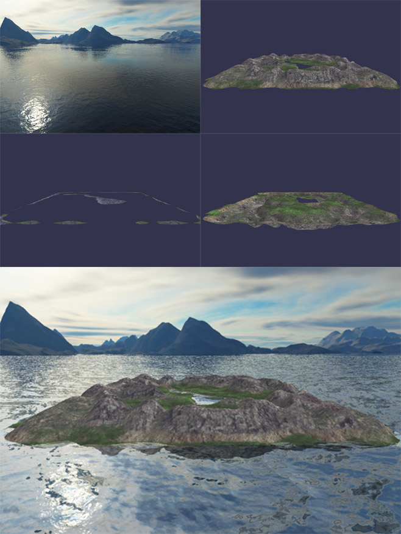

*马逸东 | 2015210056 | myd15@mails.tsinghua.edu.cn*

## A6 Terrain Engine
要求：  

* 材料见附件“Terrain Engine.pdf”。
* 摄像机坐标系与全局坐标系之间的变换；
* 海面的波浪效果；
* 地形的读取、绘制及纹理贴图；
* 天空和地形的倒影效果。

### 实验环境

Windows 10 + Visual Studio 2013 + OpenGL3.3, 依赖库：Assimp, SOIL, GLEW, GLM

### 实验原理

高度图转地形  
CubeMap映射  
FlowMap水面  
FrameBuffer制作倒影  

### 实验步骤

有关高度图转地形，读入位图数据根据灰度转为点的高度，然后计算面序号，转为VAO, VBO与EBO  
地形的着色器用了Lambert光照+DetailMap  

CubeMap使用了OpenGL自带的CubeMap功能，渲染时把View Maxtrix的Transform属性去掉，保证Skybox不乱动。  
即`glm::mat4 view = glm::mat4(glm::mat3(camera.GetViewMatrix()));`  

FlowMap是一种制作带流动方向的水面的方式，最早出现在V社的Portal2，发表在SIGGRAPH2010。有关这个技术的具体实现我写在这篇博客[OpenGL中Flowmap水面](http://ma-yidong.com/2016/11/04/flowmap%E6%B0%B4%E9%9D%A2/)中。  
不过Shader为了省事使用法线贴图计算法线并没有转到法线空间（因为水面本来是平的。。。）
FlowMap自己在Photoshop中绘制，达到水面遇到地形分叉，以及沿河流方向流动的效果。

使用RenderToTexture技术制作倒影时，先用两个Pass把地形水下的部分，倒影部分(镜像相机位置)分别渲在两个FrameBufferTexture中，然后把Texture传给水面的Shader，Shader中根据水面法线方向扰动两个Texture实现倒影的波动。  

交互操作：  
`W`: 前进  
`A`: 后退  
`S`: 向左  
`D`: 向右  
`ScrollUp`: 放大  
`ScrollDown`：缩小  
`Alt+MouseL`: Rotate  
`Alt+MouseR`: Pan  

*注：由于GLUT不支持OpenGL3.3+，并且GLEW不提供GUI功能，实验所有的交互不使用右键PopUpMenu，而都使用鼠标键盘。*  

### 实验效果

  
几个Pass  

  
实现效果  

