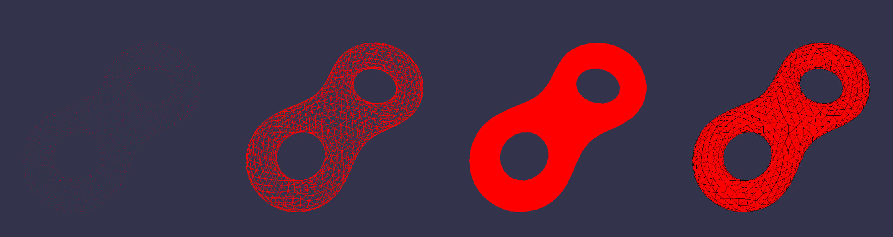

*马逸东 | 2015210056 | myd15@mails.tsinghua.edu.cn*

## B4 三维模型的显示与交互
要求：  

* 使用半边结构（half edge data structure）读入一个三维网格模型，并在屏幕上显示；
* 支持仅显示网格效果，仅显示顶点效果（自己设定顶点颜色），仅显示三角面效果（自己设定面颜色）以及同时显示面和边的效果；
* 要读入的模型见附件“eight.uniform.obj”；
* 四种显示方式参考效果见附件“模型显示.png”。  

### 实验环境

Windows 10 + Visual Studio 2013 + OpenGL3.3, 依赖库：Assimp, SOIL, GLEW, GLM

### 实验原理

读取OBJ格式，记录点与面数据；转化为半边结构；使用可编程渲染管线渲染  

### 实验步骤

考虑到读取模型格式的可扩展性，使用了开源模型库Assimp读取模型。    
这里使用了[LearningOpenGL](http://learnopengl.com/)提供的头文件[model.h]("../include/model.h")，并针对自己项目做了改写。    
然后使用了自己写的[HalfEdge.h]("../include/HaldEdge.h")将顶点与面的数据转化为半边结构。    

显示和渲染使用了改写的LearningOpenGL的相机头文件[camera.h]("../include/camera.h")，不过本例没有添加交互操作。    
由于显示简单，着色器并没写光照模型，片段着色器仅仅输出一个颜色`shadeColor`。    
显示点/边/面通过改变函数`glPolygonMode`的参数决定。    
对于面+边的显示使用两个pass，第一次渲染面第二次渲染边。   

渲染模式的切换使用键盘：  
`1`: 顶点模式  
`2`: 边框模式 Wireframe  
`3`: 纯颜色 Flat Shade  
`4`: 颜色+边框  

*注：由于GLUT不支持OpenGL3.3+，并且GLEW不提供GUI功能，实验所有的交互不使用右键PopUpMenu，而都使用鼠标键盘。*  

### 实验效果

