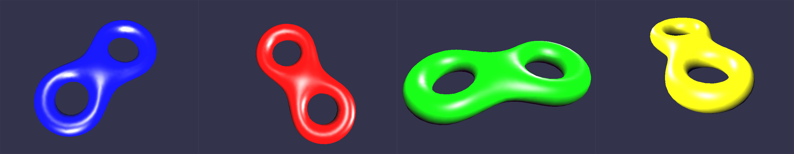

*马逸东 | 2015210056 | myd15@mails.tsinghua.edu.cn*

## B5 三维模型的交互与光照效果
要求：  

* 对第4题读入的模型使用鼠标进行旋转、缩放操作；
* 利用光照模型实现简单光照效果，使用物体材质和环境光、漫反射、镜面反射结合产生光照效果；
* 光照参考效果见附件“模型光照效果.jpg”。

### 实验环境

Windows 10 + Visual Studio 2013 + OpenGL3.3, 依赖库：Assimp, SOIL, GLEW, GLM

### 实验原理

使用可编程渲染管线渲染
光照模型使用Blinn/Phong
多光源使用前向渲染管线

### 实验步骤

基于B4的成果，显示和交互使用了改写的LearningOpenGL的相机头文件[camera.h]("../include/camera.h")。
W/A/S/D可以控制进退左右，鼠标滚轮控制放大缩小，Alt+鼠标左键做旋转，Alt+鼠标右键做平移(同MAYA习惯)

渲染采用了Blinn/Phong光照模型计算漫反射和高光。使用了两盏灯光，一个朝向(1,1,1)的平行光，一个从摄像机射出的聚光灯。
在着色器中使用前向渲染的方式，先计算平行光的光照再计算聚光灯的。

着色器提供的接口`uniform vec3 Albeido`用于改变颜色，本例可以改变四种颜色。

交互操作：
`W`: 前进
`A`: 后退
`S`: 向左
`D`: 向右
`1`: 蓝色
`2`: 红色
`3`: 绿色
`4`: 黄色
`ScrollUp`: 放大
`ScrollDown`：缩小
`Alt+MouseL`: Rotate
`Alt+MouseR`: Pan

*注：由于GLUT不支持OpenGL3.3+，并且GLEW不提供GUI功能，实验所有的交互不使用右键PopUpMenu，而都使用鼠标键盘。*

### 实验效果

