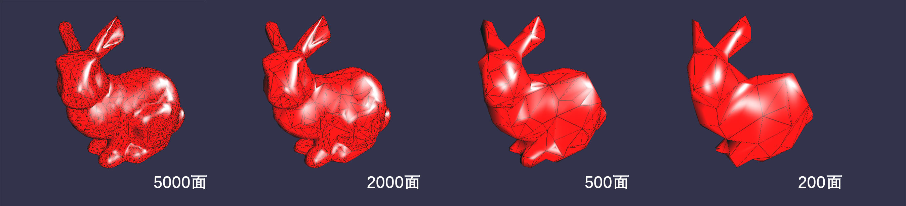

*马逸东 | 2015210056 | myd15@mails.tsinghua.edu.cn*

## B8 使用半边结构实现下列文章中的网格简化算法
要求：  

* 可以从下面的网址下载文章[Surface Simplification Using Quadric Error Metrics, by Michael Garland and Paul Heckbert, SIGGRAPH97](http://mgarland.org/research/quadrics.html)
* 弹出式菜单选择网格简化选项。

### 实验环境

Windows 10 + Visual Studio 2013 + OpenGL3.3, 依赖库：Assimp, SOIL, GLEW, GLM

### 实验原理

半边结构  
Quadric Error Metrics

### 实验步骤

利用B4的代码导入半边结构的模型，然后参照论文实现算法。

1) 计算出每个顶点Q  
2) 计算出所有可行的收缩对以及耗散，存储在堆(Heap)中  
3) 从堆中弹出收缩对进行收缩，直到达到目标  

交互操作：  
`N`: 下一个模型（总共两个模型，分别为8状环和兔子)  

`1`: 面数缩减到10%  
`2`: 面数缩减到20%  
`3`: 面数缩减到30%  
`4`: 面数缩减到40%  
`5`: 面数缩减到50%  
`6`: 面数缩减到60%  
`7`: 面数缩减到70%  
`8`: 面数缩减到80%  
`9`: 面数缩减到90%  
`0`: 不缩减面数  

`W`: 前进  
`A`: 后退  
`S`: 向左  
`D`: 向右  
`ScrollUp`: 放大  
`ScrollDown`：缩小  
`Alt+MouseL`: Rotate  
`Alt+MouseR`: Pan  

*注：由于GLUT不支持OpenGL3.3+，并且GLEW不提供GUI功能，实验所有的交互不使用右键PopUpMenu，而都使用鼠标键盘。*  

### 实验效果

  

