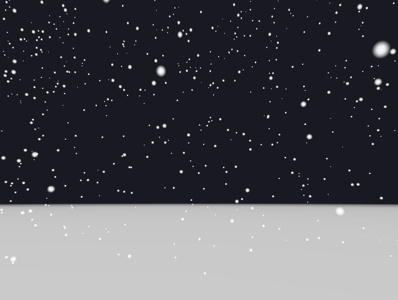
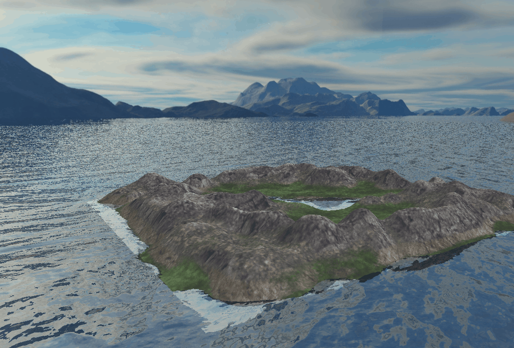

## 计算机图形学基础作业(60240073), Fall 2016

### 实验环境

Windows 10 + Visual Studio 2013 + OpenGL3.3, 依赖库：Assimp, SOIL, GLEW, GLM

### 项目列表

B4 半边结构模型  

B5 光照模型与交互  

  

B6 雪花效果  

  

B8 网格简化  

  

A2 魔方  

 

A6 地形显示  

 

Ma Yidong, 2016.12  